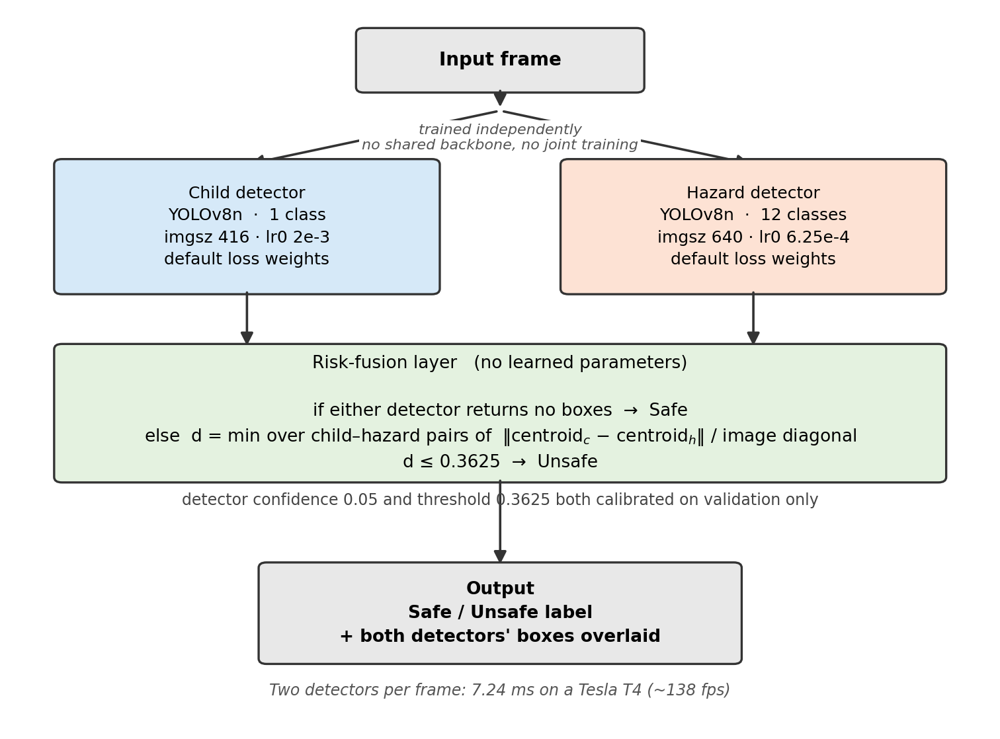
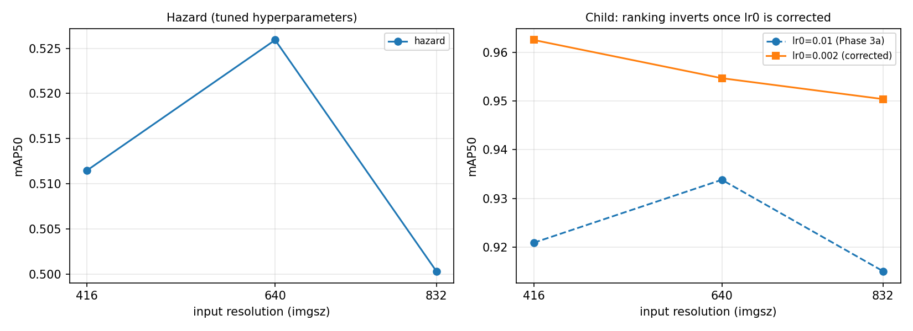
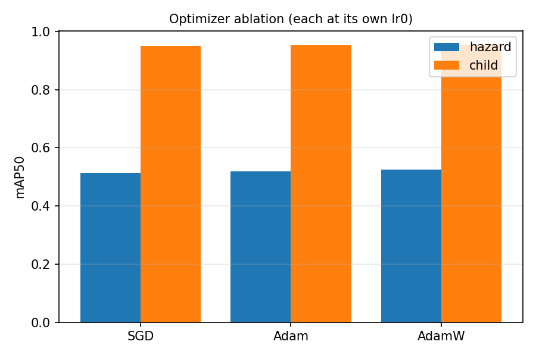
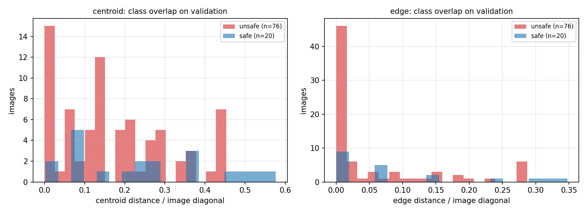
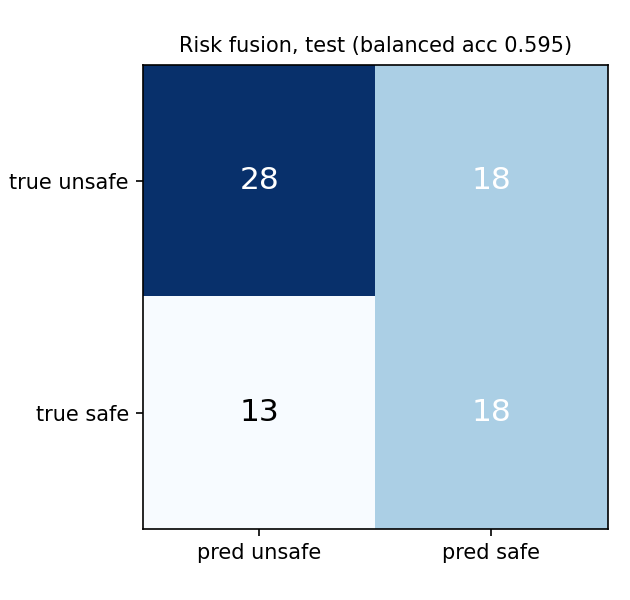
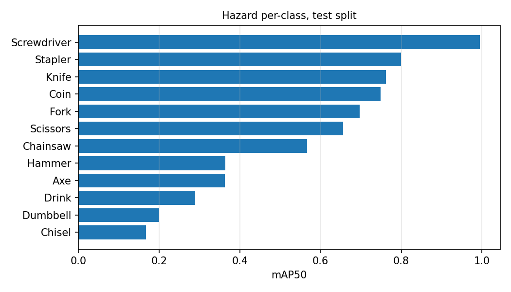
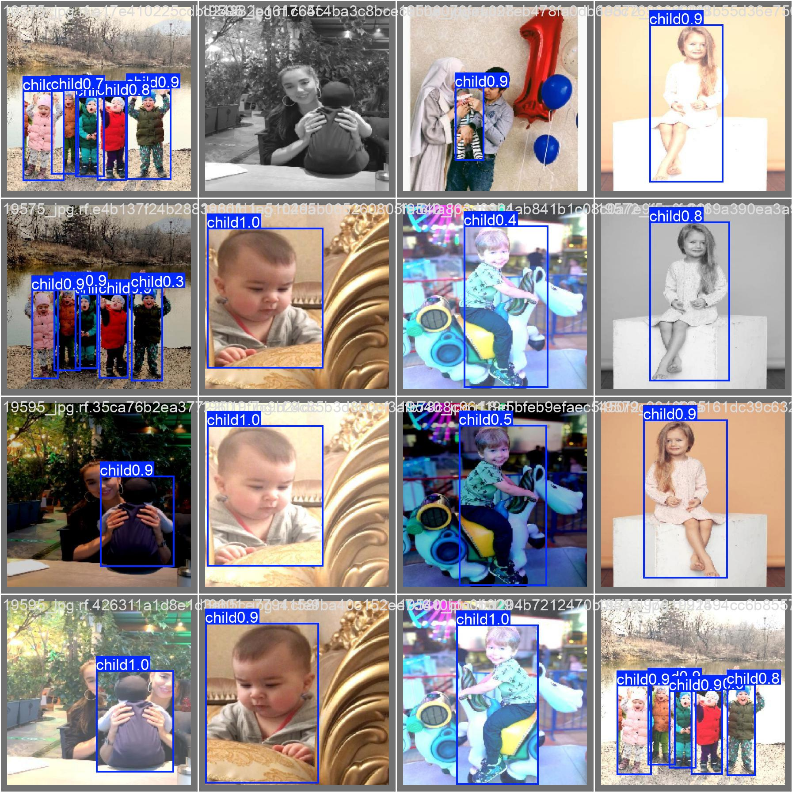
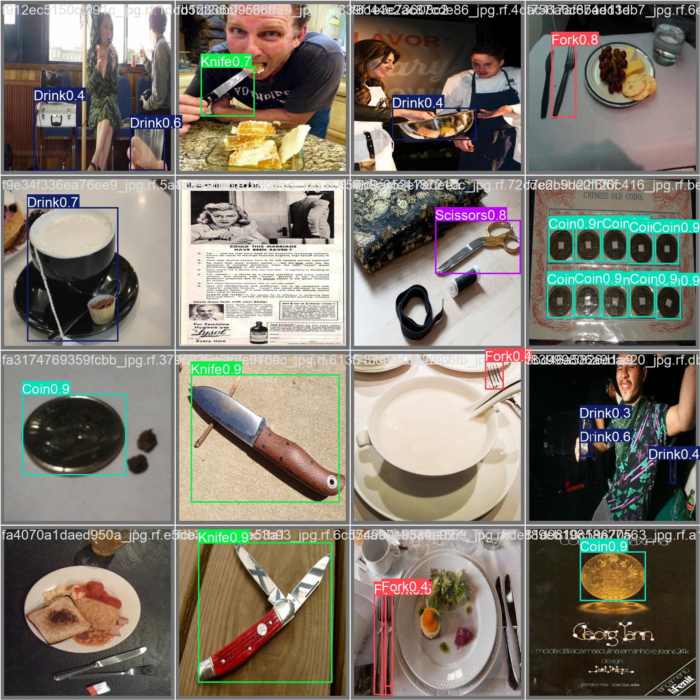

# Contextual Child Safety Risk Detector
## Detecting Children and Household Hazards Using Independently Trained Detectors

Stephen Co · James Foo · Simon Luis Ambata · Nathaniel Tolentino

College of Computer Studies, De La Salle University, 2401 Taft Avenue, Manila, Philippines

---

> **Draft status.** Section 2 (Related Work) is deliberately left as an outline —
> it requires at least eight peer-reviewed sources and only five are currently
> available. All other sections are drafted from measured results in
> `results_and_findings.md`. Every number here is traceable to a file in
> `results/metrics/`.

---

## Abstract

Young children left briefly unattended can reach household hazards such as
knives, tools or small swallowable objects. Existing home monitoring products
detect movement into manually configured zones, but have no notion of which
objects are dangerous or where those objects currently are. This work builds
and evaluates a pipeline that detects children and hazardous objects using two
separately trained nano-scale object detectors and combines their outputs with
a geometric proximity rule, producing a Safe or Unsafe label for each frame.
The two detectors reach 0.967 and 0.551 mean average precision at an
intersection-over-union threshold of 0.5 on held-out test data, and run
together in 7.2 milliseconds per frame, comfortably faster than real time. The
proximity rule reaches a balanced accuracy of 0.595 on a held-out evaluation
set, but its confidence interval includes chance, so the geometric stage is not
confirmed as effective. Detection failure, not the choice of distance measure,
is shown to be the dominant error source. Hyperparameter tuning selected on a
shortened training schedule transferred poorly and reduced final accuracy.

*(172 words — spec requires 150–200)*

---

## 1. Introduction

A child alone in a kitchen for a few minutes is enough time for a serious
injury: a knife left within reach, a tool on a low shelf, or a coin small
enough to swallow. This risk has driven a large consumer market in smart home
cameras and baby monitors. Commercial products in this category typically
offer a "danger zone" feature, in which a caregiver manually marks a region of
the home — near a staircase, a stove, or a pool — and receives an alert when
the child enters it.

That design has a structural limitation. The zone is fixed at configuration
time and the system reasons only about the child's coordinates relative to it.
It has no representation of what is dangerous, so a knife left on a low table
outside the marked region produces no alert, while a child playing safely
inside a marked region produces a false one. The hazard itself is invisible to
the system.

This work addresses that limitation directly by detecting the hazardous object
as well as the child, and computing risk from the measured distance between
them, with no manual configuration.

### 1.1 Research question

The pipeline requires two detection capabilities: locating children, and
locating a diverse set of household hazards. These can be learned by a single
multi-class model or by two independently trained specialists. The latter
avoids forcing one network to share capacity between visually dissimilar tasks,
and permits each detector to be configured independently — but requires running
two models per frame.

This work asks whether **two independently trained specialist detectors,
combined only at the output level by a geometric rule, form a workable child
safety risk detector**, and at what computational cost.

An earlier framing of this question asked whether the dual-specialist design
*outperforms* a unified multi-class model. That comparison was abandoned during
the project because it cannot be answered with the evidence available: the
published unified-model figure was obtained on a different dataset, with
different hazard classes, using a substantially larger network. Establishing
superiority would require training a unified model on the union of our own
datasets as an internal control, which was outside the compute budget. The
claim made here is therefore the weaker and supportable one: that the
specialists perform *competitively* with published figures.

### 1.2 Contributions

1. A complete, reproducible two-detector pipeline with an output-level
   proximity rule, evaluated end to end on held-out data, including the cost of
   running both detectors per frame.
2. An honest negative result on the risk-classification stage: the geometric
   rule's held-out confidence interval includes chance, and detection failure
   rather than distance measurement is identified as the dominant error source.
3. Three methodological findings that generalise beyond this application:
   that hyperparameter tuning on a shortened schedule can reduce final
   accuracy; that a sequential ablation can invert when an earlier parameter is
   corrected; and that a widely used framework default silently discards a
   hyperparameter under tuning.
4. A measured account of dataset contamination in a public dataset, with its
   effect on reported accuracy quantified rather than assumed.

---

## 2. Related Work

> **To be written.** Requires a minimum of eight peer-reviewed papers organised
> thematically. Five are currently available (see References). Suggested
> themes, each of which the current five only partially cover:
>
> - **Automated child-safety monitoring.** Existing systems and their
>   assumptions; zone-based versus object-aware approaches.
> - **Single-stage object detection.** The YOLO family and the accuracy/cost
>   trade-off that motivates nano-scale models for edge deployment.
> - **Small-object detection.** Directly relevant: our dominant failure mode is
>   missed small hazards.
> - **Multi-model fusion.** Ensembling and output-level combination of
>   independently trained detectors, versus joint multi-task training.
> - **Spatial and proximity reasoning.** Distance-based risk estimation in
>   safety-critical vision systems.
> - **Dataset quality and contamination.** Duplicate leakage across splits and
>   its effect on reported performance.
>
> Positioning to make explicit: this work synthesises the detect-then-measure-
> distance framework of prior child-safety systems, but separates detection
> into two independently trained specialists and evaluates the geometric stage
> in isolation — which prior work has not done, and which is where our negative
> result lies.

---

## 3. Methodology

### 3.1 Architecture

The pipeline has three stages, shown in Figure 1: two parallel detectors and a
fusion rule with no learned parameters.

**Figure 1.** Pipeline architecture. The two detectors are trained on separate
datasets with no shared weights and no joint training, and use different input
resolutions. Fusion is a threshold on normalised centroid distance.

**Child detector.** A YOLOv8-nano model fine-tuned on a single `child` class,
operating at 416×416 input resolution.

**Hazard detector.** A separate YOLOv8-nano model fine-tuned on twelve hazard
classes — Axe, Chainsaw, Chisel, Coin, Drink, Dumbbell, Fork, Hammer, Knife,
Scissors, Screwdriver and Stapler — operating at 640×640. All twelve classes
collapse to a single "hazard" category at fusion, but the specific class is
retained for display, so the system can report "Knife" rather than "hazard".

**Risk-fusion layer.** Given the two detectors' outputs for a frame:

1. If either detector returns no boxes, the frame is labelled **Safe**. A risk
   assessment requires both a child and a hazard to be present.
2. Otherwise, for every child–hazard box pair, the Euclidean distance between
   box centroids is computed and normalised by the image diagonal:

   *d* = ‖**c**_child − **c**_hazard‖ / √(*W*² + *H*²)

3. The minimum *d* over all pairs is compared against a calibrated threshold.
   Below the threshold the frame is **Unsafe**; otherwise **Safe**.

Normalising by the image diagonal makes *d* dimensionless and comparable across
resolutions, which a raw pixel threshold is not.

### 3.2 Design justifications

**Why two detectors rather than one.** The child class and the twelve hazard
classes differ greatly in scale, appearance and frequency. Training them
jointly forces a single backbone to allocate capacity across both, and creates
a class-imbalance problem between one common class and twelve rarer ones.
Training separately removes that coupling and allows each detector to be
configured independently — which turned out to matter, since the two detectors
converged on different optimal input resolutions.

**Why the fusion layer has no learned parameters.** Prior work on combining
independently trained detectors shows that output-level combination can match
joint training without requiring it. Keeping fusion parametric-free also means
the geometric stage can be evaluated in isolation: any failure is attributable
either to the detectors or to the rule, not to a third trained component.

**Why the detectors use different input resolutions.** This was not a design
assumption but an ablation result (Section 5.2). The single-class child task
performs best at 416, while the twelve-class hazard task — which contains
substantially smaller objects — performs best at 640. Because the models are
independent, adopting different resolutions costs nothing.

**Optimizer and loss.** Both detectors use AdamW with the standard YOLOv8
composite loss (box regression, classification, distribution focal loss),
selected by ablation (Section 5.3). Both use their framework-default loss
weights; the alternative, a tuned set, was measured and found worse
(Section 5.4).

### 3.3 Training procedure

Both detectors are fine-tuned from COCO-pretrained YOLOv8-nano weights for 100
epochs at batch size 16, with the framework's default augmentation. The child
detector uses an initial learning rate of 2×10⁻³, the hazard detector 6.25×10⁻⁴;
both follow the framework's default annealing schedule to 1% of the initial
rate over the scheduled epoch count.

The two learning rates come from the framework's own heuristic for a dataset's
class count. This is worth stating explicitly because the framework applies it
*silently*: when the optimizer is left at its automatic setting, any
user-specified learning rate is discarded and replaced. A configuration file
from such a run records the supplied value, not the value used. This behaviour
invalidates any hyperparameter search conducted under the automatic setting,
and all tuning reported here therefore names the optimizer explicitly.

---

## 4. Experimental Setup

### 4.1 Datasets

Two public datasets from Roboflow Universe, each used with its creator's
predefined split, without reshuffling.

| | Child detector | Hazard detector |
|---|---|---|
| Images | 4,705 | 5,917 |
| Unique source photographs | ~649 (≈7 copies each) | 3,863 (≈1.5 copies each) |
| Classes | 1 | 12 |
| Train / validation / test | 4,080 / 372 / 253 | 4,758 / 773 / 386 |
| Preprocessing | resize to 640×640, EXIF stripped | resize to 640×640, EXIF stripped |
| Augmentation (as distributed) | salt-and-pepper noise on 5% of pixels | 50% horizontal flip |

**Table 1.** Dataset composition.

**Two dataset defects were found and are reported rather than worked around.**

*Cross-split duplication.* Filenames in the child dataset encode the source
photograph, making duplication checkable. 386 source names span the training
and evaluation boundary; pixel comparison confirms that approximately 17% of
the validation split and 21% of the test split are near-duplicates of training
images. The effect was measured, not assumed: re-evaluating the same weights on
a decontaminated validation subset (313 of 372 images) gives 0.9465 mAP50
against 0.9548 on the full split — an inflation of 0.008 mAP50 and 0.021
mAP50-95. The contamination is real but its effect is small, and the dataset
was retained. The hazard dataset is free of cross-split duplication.

*Low source diversity.* The 4,705 child images derive from only around 649
unique photographs. Effective visual diversity is an order of magnitude below
the image count, which bounds generalisation claims more severely than the
duplication does.

**Class distribution.** Hazard classes are heavily imbalanced: validation
support ranges from 367 instances (Coin) to 5 (Chisel), a factor of roughly 70.
Classes below about 30 instances produce per-class figures that move
substantially on single detections and should not be read as reliable.

**Risk-classification evaluation set.** Neither source dataset contains frames
with a child and a hazard together, so neither can evaluate the fusion stage. A
purpose-built set of 200 composited images was constructed by pasting hazard
crops onto held-out child photographs at controlled separations (123 validation
/ 77 test, split by source photograph). Ground truth uses a *reachability*
criterion — whether the gap between boxes is at most half the child's box height
— deliberately chosen because it is not a rescaling of the distance measure
under test, so the evaluation is not circular. Section 6.2 states the
limitations of this construction.

### 4.2 Baselines

**Internal baseline.** Both detectors trained at framework-default
hyperparameters with the automatic optimizer for the same 100 epochs. This is
the comparison that determines whether tuning helped, and is the more
informative baseline.

**Published systems.** Four prior systems are used as reference points. None is
directly comparable — each was evaluated on a different dataset with different
classes, and one measures a different task — so they are reported as context
rather than as a ranking. Details and the reason each is not comparable appear
in Table 5.

### 4.3 Evaluation metrics

**Mean Average Precision (mAP).** Average precision is the area under the
precision–recall curve for a class; mAP is the unweighted mean across classes.
mAP50 uses a fixed intersection-over-union (IoU) threshold of 0.5 for counting a
detection as correct; mAP50-95 averages over IoU thresholds from 0.5 to 0.95 in
steps of 0.05, and is therefore more sensitive to localisation precision. Both
are reported: mAP50 indicates whether the object is found, mAP50-95 whether it
is found *accurately*. Because mAP is unweighted across classes, a rare class
with very few instances influences the hazard detector's overall figure as much
as a common one.

**Balanced accuracy.** For risk classification we report the mean of the two
class recalls:

BA = ½ (TP/(TP+FN) + TN/(TN+FP))

This is used in preference to plain accuracy because the evaluation set is
approximately 74% Unsafe, so a degenerate classifier that always outputs
"Unsafe" achieves 0.740 plain accuracy while contributing nothing. Balanced
accuracy scores any constant classifier at 0.500 regardless of class balance,
making it the honest headline. Precision, recall and specificity are reported
alongside, since in a safety application a false negative (a missed hazard) and
a false positive (an unnecessary alert) carry very different costs.

**Inference latency.** Milliseconds per frame, measured per detector and summed,
since the pipeline runs both on every frame.

### 4.4 Implementation details

| | |
|---|---|
| Framework | Ultralytics YOLOv8, version pinned at 8.4.106 |
| Model | YOLOv8-nano, 3.01 M parameters, 8.1 GFLOPs |
| Hardware | Google Colab, NVIDIA Tesla T4 (15 GB) |
| Epochs / batch | 100 / 16 |
| Optimizer | AdamW |
| Learning rate | child 2×10⁻³, hazard 6.25×10⁻⁴ |
| Loss weights | framework defaults (box 7.5, cls 0.5, dfl 1.5) |
| Input resolution | child 416, hazard 640 |
| Training time | child 86 min, hazard 145 min |

**Table 2.** Implementation details.

The framework version is pinned because minor versions differ in
detection-head initialisation, which shifts the same weights' reported mAP50 by
about 0.004 — small, but enough to corrupt an ablation. All results from the
tuning phase onward were produced under the pinned version. The Phase 1
baselines predate the pin, which is noted where it affects a comparison.

### 4.5 Reproducibility statement

All code, configurations and result files are in the project repository.
Specifically:

- **Data.** Both datasets are public, and `scripts/download_data.py` fetches
  them at explicitly pinned version numbers, so a later re-release cannot
  silently change the split. Two post-download fixes are required and scripted:
  the distributed configuration files contain broken relative paths, and the
  child dataset ships as two classes where the second is mislabelled instances
  of the first.
- **Determinism.** All runs use `seed=0` with deterministic mode enabled. Two
  independently launched runs of one configuration reproduced each other to
  five decimal places, confirming this. The consequence, discussed in
  Section 5.6, is that no run-to-run variance estimate exists.
- **Configuration.** The final training configuration is embedded in
  `scripts/train_final.py` rather than passed on the command line, so a final
  run cannot silently disagree with the ablations that chose it.
- **Evaluation.** `scripts/evaluate.py` produces every test-set number in one
  pass and refuses to run without an explicit confirmation flag, because the
  test splits are used exactly once.
- **Tables and figures.** Every table and figure is regenerated from the result
  files by `scripts/make_report.py`, so the paper cannot drift from the
  recorded numbers.

---

## 5. Results

All development used validation splits. The test splits were used exactly once,
at the end, with every parameter fixed in advance.

### 5.1 Main results

| System | Evaluated on | mAP50 | mAP50-95 |
|---|---|---|---|
| **Child detector (ours)** | child test split | **0.9670** | 0.9081 |
| **Hazard detector (ours)** | hazard test split | **0.5506** | 0.3958 |

| Risk classification (ours) | Value |
|---|---|
| Balanced accuracy | **0.5947** |
| 95% confidence interval | **[0.483, 0.707]** |
| Plain accuracy | 0.5974 |
| Unsafe precision / recall | 0.683 / 0.609 |
| Safe recall | 0.581 |
| Confusion (TP/FP/FN/TN) | 28 / 13 / 18 / 18 |

**Table 3.** Final held-out results. The confidence interval on the risk
classifier includes chance (0.500).

The child detector's test figure exceeds its validation figure (0.967 against
0.955). This is most plausibly explained by contamination rather than
generalisation: the child test split carries the highest measured duplication
(≈21%, against ≈17% in validation).

**Computational cost.** Child 3.05 ms and hazard 4.19 ms per image on a T4,
giving **7.24 ms per frame** for the complete pipeline, approximately 138
frames per second. Running two specialist detectors instead of one is therefore
not a meaningful cost objection at this model scale.

### 5.2 Ablation: input resolution

**Figure 2.** Resolution ablation. Right: the child ranking inverts once the learning rate is corrected — 416 moves from last to first.

Each detector was trained at 416, 640 and 832 with all else held fixed.

| imgsz | Hazard mAP50 | Child mAP50 (lr 1×10⁻²) | Child mAP50 (lr 2×10⁻³) |
|---|---|---|---|
| 416 | 0.5115 | 0.9209 | **0.9626** |
| 640 | **0.5259** | **0.9338** | 0.9547 |
| 832 | 0.5003 | 0.9150 | 0.9504 |

**Table 4.** Resolution ablation, 30 epochs per cell.

Two findings. First, **832 is worse than 640 for both detectors** — by 0.034
mAP50-95 in each case — while costing about 1.6× more inference time. Since the
effect replicates across two independent datasets, it is more credible than a
single-model result would be.

Second, and more consequentially: **the child ranking inverts depending on the
learning rate.** The child detector was never tuned, so the first ablation ran
it at the framework default of 1×10⁻², under which 640 wins. Repeated at the
correct 2×10⁻³, every resolution improves and 416 — previously last — wins on
both metrics, while running 1.97× faster. The first ablation was internally
consistent, so its comparison was not invalid; but it was conducted at a
handicapped operating point and produced a confidently wrong answer.

### 5.3 Ablation: optimizer

**Figure 3.** Optimizer ablation, each optimizer at an appropriate learning rate.

| Optimizer | Learning rate | Hazard mAP50 | Child mAP50 |
|---|---|---|---|
| SGD | 1×10⁻² | 0.5130 | 0.9509 |
| Adam | tuned / auto | 0.5181 | 0.9528 |
| **AdamW** | tuned / auto | **0.5259** | **0.9547** |

Each optimizer is given the learning rate appropriate to it rather than a
single shared value. This is deliberate: holding one rate fixed across
optimizers does not isolate the optimizer, it measures which optimizer happens
to suit that rate. Our own tuning data shows the magnitude — the same optimizer
scores 0.2325 mAP50 at one rate and 0.5020 at another. The unit of comparison
is therefore "optimizer with an appropriate learning rate". AdamW is best or
tied-best in every comparison, though the margins (0.004–0.018) are small.

### 5.4 Ablation: hyperparameter tuning

An evolutionary search over initial learning rate and the three loss weights
was run for six iterations of 20 epochs, and the winner retrained at the full
100 epochs against the untuned baseline.

| Hazard configuration | mAP50 | mAP50-95 |
|---|---|---|
| Framework defaults (baseline) | **0.5657** | **0.4072** |
| Tuned (lr 8.8×10⁻⁴, box 8.14, cls 0.75, dfl 1.06) | 0.5256 | 0.3913 |
| Difference | **−0.0401** | **−0.0159** |

**Tuning made the detector worse**, on 10 of 12 classes. The explanation is
that hyperparameters were selected on 20-epoch runs and applied to 100-epoch
training. The framework anneals the learning rate across the *scheduled* epoch
count, so a 20-epoch run is fully annealed at its end while a 100-epoch run is
only one fifth through its decay. A configuration that converges well under a
short schedule is not necessarily the one that trains best over five times as
long. The shipped hazard detector is therefore the untuned baseline.

A second limitation of the search: the initial learning rate dominated. Moving
it changed fitness by 0.170, while the entire spread across the three loss
weights was 0.034. Five of six iterations sat near a learning rate that
crippled them, so the loss weights were never resolved.

### 5.5 Ablation: distance reference

**Figure 4.** Distance distributions by class on validation. The classes overlap substantially under both measures.

The proposal anticipated that nearest-edge distance might outperform centroid
distance, since a large child box and a small hazard box can have distant
centroids while nearly touching.

| Detector confidence | Centroid | Nearest-edge | Difference |
|---|---|---|---|
| 0.25 (framework default) | 0.6683 | 0.6425 | centroid +0.026 |
| 0.05 | 0.6705 | **0.6726** | edge +0.002 |
| 0.01 | 0.6126 | 0.5307 | centroid +0.082 |

Balanced accuracy on validation. **The ranking flips with the detector
confidence threshold** — a parameter of the detectors, not of the fusion layer.
No ordering survives that change, so the two references perform equivalently
here and the original centroid design is retained.

The same experiment produced a more consequential finding. At the framework's
default confidence, **the hazard detector fails to find the hazard in 57% of
images**, and the fusion rule labels all of those Safe without computing any
distance. Under those conditions both distance measures score *below* the
degenerate always-Unsafe baseline on plain accuracy. Lowering the confidence
threshold to 0.05 reduces the failure rate to 22%. Detector confidence
therefore affects risk-classification accuracy more than the choice of distance
measure does, and must be reported as a system parameter.

### 5.6 Statistical significance

**Figure 5.** Risk-classification confusion matrix on the held-out test split.

**This is the weakest aspect of the evaluation and is stated plainly.**

The risk-classification result carries a 95% confidence interval of
[0.483, 0.707] around a balanced accuracy of 0.5947, computed from the normal
approximation to the two class recalls on 77 test images. **The interval
includes chance.** The point estimate is above 0.500 and the validation result
(0.6705) was more clearly so, but the held-out evidence does not establish that
the geometric stage performs better than chance.

For the detector results, **no variance estimate exists**. All runs use a fixed
seed with deterministic execution, and no configuration was run more than once;
two independent launches of the same configuration reproduced each other
exactly, which confirms determinism but provides no information about seed
sensitivity. Differences of 0.01–0.02 mAP reported in the ablations above
therefore cannot be distinguished from seed noise, and comparisons at that
magnitude — notably the optimizer ranking — should be read as indicative only.
Repeating one configuration across three seeds would establish an error bar and
is the single most valuable addition to this evaluation.

### 5.7 Qualitative analysis

**Figure 6.** Per-class hazard detection on test. The spread tracks annotation support, not difficulty.

**Figure 7.** Child detector predictions on validation images.

**Figure 8.** Hazard detector predictions. Small objects at low confidence are the dominant failure mode.

Per-class hazard performance on the test split ranges from 0.995 (Screwdriver)
to 0.168 (Chisel). The spread tracks annotation support rather than intrinsic
difficulty: both extremes rest on a handful of instances and are equally
unreliable. Among well-supported classes, Coin (0.748), Knife (0.761) and Fork
(0.697) perform consistently, while Drink (0.289) underperforms its support —
plausibly because the class groups bottles, cups and glasses under one label.

The dominant failure mode is a **missed small hazard**, which the fusion rule
converts directly into a false negative: 28 of 77 test frames had no hazard
detected and were labelled Safe without any distance being computed, accounting
for most of the 18 false negatives. In a safety application this is the more
harmful error direction.

A second failure mode motivated the distance-reference ablation. In images
where a child is bent over a small object held in their hands, the child's
bounding box fills a large fraction of the frame, so centroid-to-centroid
distance reads as approximately 0.4 — apparently distant — while the boxes
nearly touch. Nearest-edge distance handles these correctly. That the two
measures nonetheless perform equivalently overall indicates such cases are
outnumbered by ones where detection error dominates.

---

## 6. Discussion

### 6.1 What the results say about the research question

The question was whether two independently trained specialists combined by a
geometric rule form a workable risk detector, and at what cost. The answer
separates cleanly into three parts.

**The detection stage works and the dual-model cost is negligible.** The child
detector reaches 0.967 mAP50 and the hazard detector 0.551, and both run
together in 7.24 ms per frame. The architectural concern that motivated the
question — that running two models might be prohibitive — is not borne out at
this scale.

**The geometric stage is not confirmed.** Balanced accuracy of 0.595 with an
interval spanning chance means the proximity rule cannot be claimed to work.
This is the central negative result.

**The bottleneck is detection, not geometry.** The rule can only act when both
objects are found, and the hazard detector misses more than half of them at the
framework's default confidence. Effort spent refining the geometric rule is
misdirected while that holds. This reframes the problem: the limiting factor is
small-object detection under realistic conditions, not the distance formula.

### 6.2 Limitations

**The risk evaluation set is composited.** Hazard crops were pasted onto child
photographs at controlled separations. This gives exact geometry and a
non-circular ground truth, but pasted objects have visible boundaries and no
lighting or perspective matching. They therefore test the pipeline's
*mechanics* rather than establishing that proximity predicts real-world danger,
which would require real photographs with independent human judgement.

**The ground-truth criterion embeds an assumption.** "Unsafe" is defined as the
gap being at most half the child's bounding-box height. That threshold is a
stated modelling choice, not a measured quantity. It is also not a constant
physical distance: the child dataset annotates a head in roughly 40% of images
and a full body in 57%, so the same ratio corresponds to different real
distances.

**Sample size.** 77 test frames is too few to resolve the effect being
measured, as the confidence interval shows.

**No variance estimates.** Discussed in Section 5.6.

**Sequential ablation.** Hyperparameters, then resolution, then optimizer were
chosen in sequence, each conditioned on the previous winner. Section 5.2 shows
this assumption failing in practice. The hazard resolution result inherits the
same structure and has not been re-verified under the final optimizer.

**Dataset limitations.** Both the duplication and the low source diversity in
the child dataset (Section 4.1) bound how strongly generalisation can be
claimed.

### 6.3 Ethical considerations

**This system must not be presented as a substitute for supervision.** Its
measured false-negative rate is high: it missed 18 of 46 unsafe frames in
testing. A caregiver who trusts such a system and reduces direct attention
would be worse off than one who does not use it. Any deployment must frame the
output as a supplementary alert, never as an assurance of safety, and the
false-negative rate must be disclosed to users in terms they can act on.

**Surveillance of children.** The system requires continuous camera coverage of
spaces where children are, generating exactly the footage that is most
sensitive if breached, and creating a record of a child's movements they cannot
consent to. On-device processing without retention would mitigate this; the
present work does not implement it.

**Demographic bias is unmeasured and likely present.** The child dataset
derives from around 649 unique photographs sourced from the web, with no
recorded distribution of skin tone, age, body size, clothing, or setting. A
detector trained on such a set may perform unevenly across groups, and in this
application uneven performance means uneven protection — a failure that falls
hardest on children least represented in the data. We did not measure this, and
that omission is itself a limitation. A deployable version would require a
demographically documented evaluation set.

**Hazard definition is cultural and contextual.** The twelve classes reflect a
particular notion of what is dangerous. "Coin" is a hazard for a toddler and
not for an eight-year-old; "Drink" may be a glass of water. A system that
alerts indiscriminately will produce false alarms that erode trust, and
alert fatigue in a safety system is itself a safety problem.

**Misuse.** Continuous child-tracking infrastructure can be repurposed for
monitoring domestic workers or family members, and the same detect-and-measure
pattern generalises to surveillance unrelated to safety. The detection
components are not novel enough for their release to add meaningful capability,
but the framing of the application invites scope creep that developers should
resist deliberately.

---

## 7. Conclusion

We built and evaluated a child safety risk detector from two independently
trained nano-scale detectors and a parameter-free geometric fusion rule. The
detectors perform competitively — 0.967 and 0.551 mAP50 on held-out test data —
and run together in 7.24 ms per frame, showing that the dual-specialist design
carries no meaningful computational penalty at this scale. The risk
classification stage reached 0.595 balanced accuracy with a confidence interval
that includes chance, so the geometric rule is not confirmed to work.

The most useful finding is diagnostic rather than architectural. Detection
failure, not distance measurement, dominates the error: the hazard detector
misses more than half of the hazards at default confidence, and each miss
becomes a false negative before geometry is ever consulted. The distance
reference — the design question the project set out to examine — proved not to
matter, with the ranking between centroid and edge measures flipping according
to a detector parameter.

Three methodological results carry beyond this application. Hyperparameters
selected on a shortened training schedule transferred poorly and *reduced*
final accuracy by 0.040 mAP50, because the learning-rate schedule is defined
over the scheduled epoch count. A resolution ablation inverted its conclusion
once an earlier hyperparameter was corrected, showing that sequential ablation
can give confidently wrong answers. And a widely used framework silently
discards a user-specified learning rate under its automatic optimizer setting,
which invalidates any search run that way.

**Future work**, in order of expected value:

1. **Improve small-hazard detection**, since it is the binding constraint. A
   larger backbone, higher resolution for the hazard branch alone, or a
   detector designed for small objects would all address the dominant error
   directly.
2. **Build a real, human-labelled co-occurrence evaluation set.** Only this can
   establish that proximity predicts genuine danger rather than constructed
   geometry, and only this can settle the distance-reference question
   non-circularly.
3. **Report variance.** Repeating configurations across seeds would let the
   small differences in the ablations be interpreted at all.
4. **Treat detector confidence as a tuned parameter**, since it affects
   risk-classification accuracy more than the fusion design does.
5. **Replace the binary label with a graded risk score**, which would let the
   system express uncertainty rather than committing to Safe on a missed
   detection — the failure mode that currently causes most harm.

---

## References

> Five of the required minimum of eight. To be extended alongside Section 2.

[1] Ahmad, M. H., Din, U. U., Hussain, F., Farooq, M., Khan, A., & Haq, I. U.
(2025). A Computer Vision Based Child Safety Solution Using YOLOv8
Architecture. *International Journal of Innovations in Science & Technology*,
7(7), 297–306.

[2] AlMhdawi, A. K., Nnamoko, N., & Ubaid, A. M. (2026). Intelligent Spatial
Estimation for Fire Hazards in Engineering Sites: An Enhanced YOLOv8-Powered
Proximity Analysis Framework. *arXiv preprint* arXiv:2603.09069.

[3] Solovyev, R., Wang, W., & Gabruseva, T. (2021). Weighted boxes fusion:
Ensembling boxes from different object detection models. *Image and Vision
Computing*, 107, 104117.

[4] Ramadan, N., Muhtadi, M., Rafi, M. Z., & Waluyo, R. E. (2025). Risk
Detection System for Children Putting Objects into Mouth Based on Computer
Vision using YOLOv11n. *Indonesian Journal of Innovation Studies*, 26(4).

[5] Khan, F. A., & Dey, A. (2024). Towards enhancing child safety: A deep
learning approach to detect child safe and unsafe objects. In *2024 IEEE
International Women in Engineering (WIE) Conference on Electrical and Computer
Engineering (WIECON-ECE)* (pp. 123–128). IEEE.
